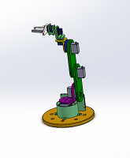

# Homemade Manipulator Arm Project

Welcome to the Homemade Manipulator Arm project repository! This project features a DIY robotic arm with 6 degrees of freedom (6DoF) and a gripper. The arm is controlled using 4 MG1501 servos and 3 SG90 servos. The project includes SolidWorks 3D part designs, electrical schemas created with EasyEDA, and the ESP code for controlling the arm.
Use [PlatformIO](https://platformio.org/) in Visual Studio Code (VSCode) to manage and upload the code to the ESP microcontroller.

## Contents

- [Description](#description)
- [Components](#components)
- [Folder Structure](#folder-structure)
- [Usage](#usage)
- [Credits](#credits)
- [Sponsors](#sponsors)
- [License](#license)

## Description

This project is a homemade manipulator arm designed for educational purposes and hobbyist robotics enthusiasts. The arm is built using 3D-printed parts designed in SolidWorks and controlled using ESP32 microcontroller boards. The control methods include Bluetooth Low Energy (BLE) using the [RemoteXY](https://remotexy.com/) library or manual control using encoders (potentiometers).

The kinematics of the manipulator are represented using the Denavit-Hartenberg (DH) notation as follows:

| Link | a   | α (deg) | d     | θ (deg) |
|------|-----|---------|-------|---------|
| 0    | 0   | 90      | 94.85 | 90      |
| 1    | 104 | 0       | 0     | 90      |
| 2    | 104 | 0       | 0     | 0       |
| 3    | 0   | 90      | -7.65 | 90      |
| 4    | 0   | -90     | 66.6  | 0       |
| 5    | 0   | 0       | 66.6  | 0       |

- `a_i`: Represents the link length along the \(x_i\) axis.
- `α_i`: Represents the twist angle about the \(x_i\) axis in degrees.
- `d_i`: Represents the link offset along the \(z_{i-1}\) axis.
- `θ_i`: Represents the joint angle about the \(z_{i-1}\) axis in degrees.

## Components

The manipulator arm features the following components:

- **Servos**:
  - 4 x [MG1501](https://www.pololu.com/file/0J729/HD-1501MG.pdf) servos (for joints)
  - 3 x [SG90 servos](http://www.ee.ic.ac.uk/pcheung/teaching/DE1_EE/stores/sg90_datasheet.pdf) (for gripper and the last wrists)
  
- **Electronics**:
  - ESP32 microcontroller board
  - PCB Board to control the robot
  - PCB Board with Potentiometers (for manual control using encoders)
  
- **3D Parts**:
  - Various parts designed in SolidWorks for the arm's structure
  
- **Electrical Schemas**:
  - Schemas created in EasyEDA for the wiring and electronic components layout
  - Full BOM can be found:
     [For Manipulator](./schemas/Main%20Board/BOM_Manip.csv)
     [For Potentiometers](./schemas/Potentiometer/BOM_Potensiometers.csv)
## Folder Structure

The repository is organized as follows:

/[Code](./Code/)
 &nbsp;&nbsp;&nbsp;&nbsp;├── [src/main.cpp](Code/src/main.cpp) &nbsp;&nbsp;&nbsp;# Main file of the Project
 &nbsp;&nbsp;&nbsp;&nbsp;├── [lib](Code/lib)&nbsp;&nbsp;&nbsp;&nbsp;&nbsp;&nbsp;&nbsp;&nbsp;&nbsp;&nbsp;&nbsp;&nbsp;&nbsp;&nbsp;&nbsp;&nbsp;&nbsp;&nbsp;&nbsp;&nbsp; # Folder containing help libraries
 /[Cad](./Cad/)
 &nbsp;&nbsp;&nbsp;&nbsp;├── [stl](./Cad/stl/)&nbsp;&nbsp;&nbsp;&nbsp;&nbsp;&nbsp;&nbsp;&nbsp;&nbsp;&nbsp;&nbsp;&nbsp; # Folder with stl files for 3D 
 &nbsp;&nbsp;&nbsp;&nbsp;├── *.sldprt &nbsp;&nbsp;&nbsp;&nbsp;# SolidWorks files 
printing
 /[Electrical_Schemas](./schemas/)
 &nbsp;&nbsp;&nbsp;&nbsp;    ├── [Main Board](./schemas/Main%20Board/)  &nbsp;&nbsp;&nbsp;&nbsp;&nbsp;&nbsp;&nbsp;&nbsp;&nbsp;&nbsp;&nbsp;&nbsp;&nbsp;&nbsp;&nbsp;&nbsp;&nbsp;&nbsp;&nbsp;   # Electrical schemas created in EasyEDA for the robot control PCB
 &nbsp;&nbsp;&nbsp;&nbsp;    ├── [Potentiometer Board](./schemas/Potentiometer/) &nbsp;&nbsp;&nbsp;&nbsp;  # Electrical schemas created in EasyEDA for the Potentiometer PCB
  /[docs](./docs/) &nbsp;&nbsp;&nbsp;&nbsp; # Datasheets for some of the components
  /[robodk](./robodk/) &nbsp;&nbsp;&nbsp;&nbsp; # Robodk station with the robot. Note: The movement of the manipulator in robodk is not exactly the same due to robodk mechanism build limitations.
 /README.md                             
## Usage

To replicate or modify this project, follow these steps:

1. **3D Printing**:
   - Print the 3D parts from the `\Cad\stl` directory using a 3D printer

2. **Assembly**:
   - Assemble the printed parts and servos according to the design

3. **Electronics**:
     Choose one of the following methods:
     - **Option 1: Order PCB Boards**:
       - Use the provided PCB design files (`*.zip`) in the repository's attachments to order custom PCB boards.
        -  [Manipulator Main PCB](./schemas/Main%20Board/Gerber_Manip_PCB.zip)
        - [Potentiometer PCB](./schemas/Potentiometer/Gerber_Potensiometers_PCB.zip)
     - **Option 2: Manual Wiring**:
       - Refer to the electrical schemas (`Electrical_Schemas`) and wire up the servos, microcontroller, and other components manually based on the schematic PDFs (`*.pdf`).
        -  [Manipulator Main Scheme](./schemas/Main%20Board/Schematic_Manip.pdf)
        - [Potentiometer Scheme](./schemas/Potentiometer/Schematic_Potensiometers.pdf)

4. **Programming**:
   - Use PlatformIO in Visual Studio Code (VSCode) to manage and upload the code

5. **Control**:
   - Use the RemoteXY library for BLE control, or wire up potentiometers for manual control

## Credits

This project was created by Tamir Mhabary. Feel free to contribute by submitting pull requests or reporting issues.

## Sponsors
This project is proudly sponsored by [PCBWay](https://www.pcbway.com/).\
[PCBWay](https://www.pcbway.com/)  provided the manufacturing of the PCB boards and 3D printing services for this project. 

[PCBWay](https://www.pcbway.com/)  is a one-stop solution for PCB prototyping, manufacturing, and assembly, as well as 3D printing services. Their high-quality products and excellent customer service make them a top choice for electronics enthusiasts and professionals alike.\
Visit [PCBWay](https://www.pcbway.com/) for more information on their services and to get started on your own projects!

## License

This project is licensed under the [MIT License](LICENSE). Feel free to use, modify, or distribute this code and design for personal or educational purposes.
